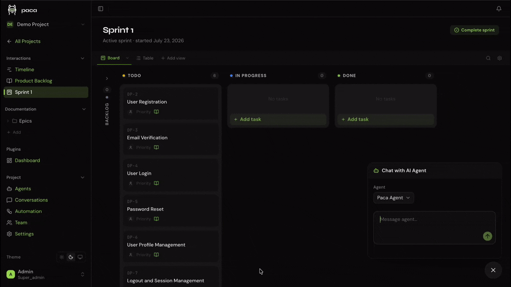

# com.paca.dashboard

First-party Paca plugin providing a fully customizable, drag-and-drop
dashboard builder. Users add "panels" (charts, data tables, or text blocks)
backed by their own SQL queries, arranged freely on a grid, across three
scopes:

1. **Project dashboard** — one editable dashboard per project.
2. **Admin dashboard** — one instance-wide, cross-project dashboard.
3. **Integration dashboard views** — exactly one dashboard per host
   interaction view, surfaced inside Integration pages (backlog/sprint/
   timeline) via the host's "Add view" popover. Want a second dashboard?
   Add a second "Dashboard"-type view from the host — the plugin no longer
   manages its own list/switcher.



---

## Architecture

```
dashboard/
├── backend/   — Go WASM plugin (runs inside the API host)
├── frontend/  — React micro-frontend (Module Federation remote)
├── mcp/       — MCP tool server (for AI agent access)
└── skills/    — Agent skill(s) documenting how to use the MCP tools
```

### Data model

The plugin owns two tables (see
`backend/migrations/0001_create_dashboard_tables.sql`):

- **`dashboard_views`** — one row per dashboard. `scope` is one of
  `project` | `admin` | `integration`.
  - `project` scope: exactly one row per `project_id`, created lazily
    (get-or-create) the first time a project's dashboard page loads.
    Cannot be deleted or renamed away from its default.
  - `admin` scope: exactly one row total, `project_id` is `NULL`,
    created lazily the first time the admin dashboard page loads.
  - `integration` scope: exactly one row per `host_view_id` (the host's
    own interaction-view record id — a "Dashboard"-type view created via
    the host's "Add view" popover in Backlog/Sprint/Timeline), created
    lazily the first time that specific host view is opened. Same
    get-or-create-singleton shape as project/admin, just keyed by
    `host_view_id` instead of `project_id`/nothing.
  - A partial unique index enforces "at most one row" per key for all
    three scopes (`uq_dashboard_views_one_project_scope` /
    `uq_dashboard_views_one_admin_scope` /
    `uq_dashboard_views_one_per_host_view`) without a separate flag column.
- **`dashboard_panels`** — one row per panel, belonging to exactly one
  `dashboard_views` row. `type` is `chart` | `table` | `text`.
  - `chart`/`table` panels carry a `query` (raw SQL, see Query Safety
    below) and, for charts, a `chart_type` (`bar` | `line` | `donut`).
  - `text` panels carry `content` instead and have no query.
  - `pos_x`, `pos_y`, `width`, `height` are grid units (react-grid-layout
    convention: a 12-column grid, `width`/`height` in grid cells) and are
    updated in bulk via the layout endpoint after a drag/resize.
  - `viz_config` is a free-form JSON blob reserved for future
    chart-specific display options (axis labels, colors, etc.) — currently
    unused by the frontend beyond being persisted round-trip.

### Backend (`backend/`)

- Written in Go, compiled to `wasip1/wasm` for production.
- Registered as `com.paca.dashboard` in the plugin registry.
- Route map (see `backend/plugin.go` for the authoritative list):

  | Method | Path | Scope |
  |--------|------|-------|
  | GET | `/dashboard/view` | project singleton (get-or-create) |
  | GET | `/dashboard/admin-view` | admin singleton (get-or-create) |
  | GET | `/dashboard/view/:hostViewId` | integration singleton (get-or-create, one per host view) |
  | GET | `/dashboard/views/:viewId` | any scope, by resolved dashboard id |
  | POST | `/dashboard/views/:viewId/panels` | create panel (project/integration) |
  | PATCH/DELETE | `/dashboard/views/:viewId/panels/:panelId` | update/delete panel |
  | PATCH | `/dashboard/views/:viewId/panels/layout` | bulk layout commit |
  | POST | `/dashboard/views/:viewId/panels/:panelId/data` | run a saved panel's query |
  | POST/PATCH/DELETE | `/dashboard/admin-view/panels[/...]` | admin-scope mirrors of the above |
  | POST | `/dashboard/query/preview` (or `/dashboard/admin-query/preview`) | validate + run a not-yet-saved query |

  All routes shown here are relative to `/api/v1/plugins/com.paca.dashboard`
  and get their `:projectId` prefix (where applicable) added by the host per
  `plugin.json`'s route table.

### Frontend (`frontend/`)

- Vite + React + TanStack Query, Module Federation remote
  (`com_paca_dashboard`) exposing three entry points:
  - `./ProjectDashboardPage` — `project.page` extension point.
  - `./AdminDashboardPage` — `admin.page` extension point.
  - `./DashboardIntegrationView` — `view` extension point (see
    "Integration view architecture" below).
- Shared UI, in dependency order:
  - `types.ts` — response/request shapes mirroring the backend JSON.
  - `api.ts` — all TanStack Query hooks (queries + mutations).
  - `PanelGrid.tsx` — the drag/resize canvas, wraps `react-grid-layout` v2
    (`GridLayout` + `useContainerWidth`). Layout changes are batched into a
    single bulk commit on drag/resize stop, not on every intermediate tick.
  - `PanelCard.tsx` — one panel's chrome (drag handle, refresh, edit,
    delete) plus body dispatch by `panel.type`.
  - `SimpleCharts.tsx` — dependency-free inline-SVG bar/line/donut
    renderers. No charting library exists anywhere in the monorepo and a
    panel's query result is expected to be small (one label column + one
    numeric column), so this avoids adding a real charting dependency.
  - `PanelEditor.tsx` — the add/edit panel modal: type picker, chart-type
    picker, SQL textarea with a live "Preview" button (calls the
    query-preview endpoint) and inline guardrail error display, or a plain
    textarea for text panels.
  - `DashboardBody.tsx` — the scope-agnostic body: fetch-on-mount panel
    data, add-panel affordance, and wiring for the grid + editor. Shared
    verbatim by all three entry points.
- `react-grid-layout` (`^2.2.3`) is the one new frontend dependency this
  redesign introduces — nothing in the monorepo previously had drag/resize
  grid functionality.

### Integration view architecture

The host's `view` extension point (`ViewExtensionProps`) forwards a stable
`viewId` — the host's own interaction-view record id, unique per view
instance and stable across renames/reloads — alongside `projectId`. This
plugin uses `viewId` directly as the key for a get-or-create-singleton
dashboard (`GET /dashboard/view/:hostViewId`, `host_view_id` column), the
same pattern as the project/admin scopes. `DashboardIntegrationView.tsx`
therefore has no list/create/rename/delete UI of its own: each "Dashboard"
view the host creates simply renders its own dashboard, and creating a
second dashboard means creating a second "Dashboard"-type view from the
host's own "Add view" popover — not a switcher inside this plugin.

### Query safety model

The host's Postgres is a single shared, multi-tenant database. An
unrestricted SQL textbox would let one project's dashboard author read
another project's task titles, documents, or worse. Rather than ban raw
SQL outright (capping flexibility to whatever a structured query builder
could express) or build a full query builder (large scope for a v1), this
plugin ships a **guarded raw-SQL** model — see `backend/query_guard.go` for
the authoritative implementation:

1. Exactly one statement, and it must start with `SELECT` or `WITH`. No
   `INSERT`/`UPDATE`/`DELETE`/`DROP`/`ALTER`/`CREATE`/`GRANT`/`TRUNCATE`/
   `COPY`/`CALL`/`EXPLAIN`/`VACUUM`, and nothing after a trailing `;`.
2. No `information_schema`/`pg_catalog`/`pg_*` introspection, `dblink`,
   `lo_*`, or `COPY` — closes standard sandbox-escape tricks.
3. **Project/integration-scoped queries must use the literal placeholder
   `{{project_id}}` exactly once, as a direct `<column> = {{project_id}}`
   (or reversed) equality filter, with no bare `OR` anywhere in the
   query.** The guard substitutes it with `$1` and binds the caller's real
   `project_id` — this is what actually prevents cross-project data
   leakage, by forcing every project-scoped query to filter itself in a way
   that can't be short-circuited (a duplicated/self-compared placeholder, a
   comparison operator other than `=`, or a sibling `OR` can all make the
   filter match regardless of project — see `validateProjectScopePlaceholder`
   in `query_guard.go`). Need a multi-value filter? Use `IN (...)` instead
   of `OR`. Admin-scope queries are intentionally cross-project and skip
   this requirement (and reject the placeholder if present).
4. An explicit `LIMIT 500` is appended when the query doesn't already
   declare one.

There used to be a fifth rule here: a per-table read whitelist restricting
which tables could appear after `FROM`/`JOIN`, which is how sensitive
tables (`users.password_hash`, `api_keys`, etc.) and other plugins' tables
were kept out of panel queries. That's gone — table-level access is no
longer this plugin's concern. The API host itself now redacts any column a
plugin declares sensitive (`plugin.json`'s `backend.sensitiveFields`, plus a
host-side registry for platform secrets like `users.password_hash`) to
`"***"` for every caller except the declared owner or an explicit requester
(`backend.requestedSensitiveFields`) — see
`services/api/internal/platform/plugin/runtime.go`. A panel query against
`users` or another plugin's schema now reaches Postgres; it just comes back
with sensitive values masked, same as any other plugin would see.

This is a pattern-based guard, not a full SQL parser — deliberately
conservative, rejecting anything it can't confidently classify as safe
rather than risk a false negative.

> **Note on this default:** the query-safety approach was proposed to the
> user (raw SQL vs. guarded raw SQL vs. a fully structured query builder)
> and implemented as guarded raw SQL (option 2) as a reasonable default
> when no response was received. If a different safety posture is wanted
> later, the natural places to change are `query_guard.go`'s
> `validateQuery` (backend enforcement) and `PanelEditor.tsx`'s SQL
> textarea (frontend UX) — the two are independent of the rest of the
> panel/view CRUD.

### Authorization

Access to the dashboard *page* is gated separately from access to individual
*data*. Two custom permissions, declared in `plugin.json` and each available
at both project and global **permission** scope (the same key checked
against two different permission maps, mirroring `paca-plugin-time-logging`).
This is the only "scope" the permission system itself has —
`requirePermissions`/`customPermissions` entries are always either
`"project"` (checked against the caller's per-project permission map) or
`"global"` (checked against their global permission map). There is no third,
"admin" permission scope, even though the paragraphs below also need to talk
about `dashboard_views.scope`, an unrelated data-model column on this
plugin's own table that happens to have a value literally named `"admin"` —
every occurrence of "admin" below refers to that column's value or to the
`/admin/*`-routed pages, never to a permission scope:

- **`dashboard.view`** — see the project's (or admin's) Dashboard page and
  its panels.
- **`dashboard.manage`** — create, edit, delete, and rearrange panels, and
  run query previews while authoring them. Implies `dashboard.view` for
  loading purposes — a role with only `dashboard.manage` isn't blocked from
  the page itself.

Every project-*permission*-scope backend route requires `dashboard.view` at
minimum, declared directly in the manifest's `requirePermissions` —
including the routes shared with dashboards whose `dashboard_views.scope`
is `"integration"` (embedded in Backlog/Sprint/Timeline, see "Integration
view architecture" above), which the manifest can't distinguish from the
`dashboard_views.scope == "project"` singleton by path alone. There is no
"always open" carve-out for the embedded surface: `dashboard.view` gates
the whole feature uniformly, project page and embedded views alike.
`views.go`'s `loadViewWithPanels` and `getOrCreate*View` handlers re-check
this in-handler too, as defense-in-depth against the manifest ever being
misedited — not because the manifest leaves any gap today.

On top of that `dashboard.view` floor, mutating a panel requires a second,
narrower check in `panels.go`'s `canManagePanel`, which resolves the
request's `dashboard_views.scope` value and picks the (project-permission-
scope) permission that matches:

- row's `dashboard_views.scope` is `"project"`: requires `dashboard.manage`.
- row's `dashboard_views.scope` is `"integration"`: requires `views.write`
  instead of `dashboard.manage` — an integration dashboard is embedded in,
  and shares the write bar of, the view that hosts it. `views.write` is
  exactly the permission that already lets an ordinary project Editor
  create that hosting view in the first place; requiring anything higher
  here would be a dead end (create the view, never populate it).
- row's `dashboard_views.scope` is `"admin"`: never reaches this function —
  those routes are already fully gated at the manifest level by
  `dashboard.manage` at **permission** scope `"global"`.

This two-layer shape (`dashboard.view` as a uniform manifest-level floor,
a data-scope-specific manage permission checked in-handler on top) is
deliberate: `requirePermissions` ANDs every permission it lists, so putting
`dashboard.manage` directly in the manifest on a route shared with the
`"integration"` data scope would reject a `views.write`-holding Editor
before the in-handler check ever ran.

`POST /dashboard/query/preview` (project permission scope) has no
`dashboard_views` row to resolve a data scope from — it validates a
not-yet-saved query directly against the caller's project, and is used by
both the project-dashboard editor and the integration-view editor with no
way to tell which from the request alone. Past the manifest's
`dashboard.view` floor, it requires
`dashboard.manage` in-handler (matching that permission's own description,
which promises coverage of "running query previews while authoring"
panels). The one remaining, accepted gap: a hand-crafted custom role
granted only `views.write` (able to populate an integration dashboard)
can't preview a query for it through this route — closing that fully would
need the frontend to pass a `viewId` so the backend can resolve scope, a
small API contract change tracked as a follow-up rather than done here.

### MCP (`mcp/`)

`mcp/src/index.ts` exposes the panel/view API to AI clients (Claude, GitHub
Copilot, Cursor, etc.) via `@paca-ai/plugin-sdk-mcp`, mirroring
`backend/plugin.go`'s route map one-for-one:

| Tool | Backend route |
|---|---|
| `dashboard_get_view` | `GET /dashboard/view`, `/dashboard/view/:hostViewId`, or `/dashboard/views/:viewId` (branches on which optional arg is passed) |
| `dashboard_preview_query` | `POST /dashboard/query/preview` |
| `dashboard_create_panel` | `POST /dashboard/views/:viewId/panels` |
| `dashboard_update_panel` | `PATCH /dashboard/views/:viewId/panels/:panelId` |
| `dashboard_delete_panel` | `DELETE /dashboard/views/:viewId/panels/:panelId` |
| `dashboard_update_panel_layout` | `PATCH /dashboard/views/:viewId/panels/layout` |
| `dashboard_get_panel_data` | `POST /dashboard/views/:viewId/panels/:panelId/data` |
| `dashboard_get_admin_view` | `GET /dashboard/admin-view` |
| `dashboard_preview_admin_query` | `POST /dashboard/admin-query/preview` |
| `dashboard_create_admin_panel` | `POST /dashboard/admin-view/panels` |
| `dashboard_update_admin_panel` | `PATCH /dashboard/admin-view/panels/:panelId` |
| `dashboard_delete_admin_panel` | `DELETE /dashboard/admin-view/panels/:panelId` |
| `dashboard_update_admin_panel_layout` | `PATCH /dashboard/admin-view/panels/layout` |
| `dashboard_get_admin_panel_data` | `POST /dashboard/admin-view/panels/:panelId/data` |

Panel-mutating tool arguments are camelCase (`chartType`, `posX`, …) and get
mapped onto the backend's snake_case body shape (`chart_type`, `pos_x`, …)
inside `handleToolCall`. Update the table above alongside any future route
changes in `backend/plugin.go`.

> **Note:** an earlier version of this file exposed
> `dashboard_project_overview`/`dashboard_instance_overview`, calling
> `/dashboard/overview` and `/dashboard/overview-all` — routes that predate
> the panel-based redesign and were never implemented in `backend/plugin.go`
> (nor called by the frontend). Those dead route entries have been removed
> from `plugin.json`, and the MCP tools above replace them with the current
> panel/view API surface.

### Skills (`skills/`)

`skills/paca-dashboard-builder/SKILL.md` teaches an AI agent how to build a
dashboard end-to-end using the tools above: resolving the right view across
the three scopes, the query safety model (the `{{project_id}}` placeholder,
forbidden keywords, the implicit `LIMIT 500`), a schema reference for the
host's task/sprint tables, and a library of copy-paste preset queries (status
breakdowns, burndown/burnup, workload, overdue tasks, sprint velocity) so the
agent doesn't have to hand-write SQL against an unfamiliar schema. Registered
in `plugin.json`'s `skills.names`.

---

## Development

### Backend

```bash
cd backend

# Run tests
go test -race -v ./...

# Lint
golangci-lint run --timeout=5m

# Build WASM binary (requires TinyGo — see https://tinygo.org/getting-started/install/)
tinygo build -target=wasip1 -buildmode=c-shared -o dashboard.wasm .
```

`-buildmode=c-shared` is required, not optional: without it, TinyGo doesn't
wire up the WASI reactor entry point (`_initialize`), and every call into
the plugin panics at runtime with "//go:wasmexport function called before
runtime initialization" — it still compiles fine without the flag, so this
only shows up once the plugin is actually loaded.

`main.go` carries a `//go:build wasip1` tag, so a plain `go build ./...`
without `-target=wasip1` (or, with the standard Go compiler, `GOOS=wasip1
GOARCH=wasm`) will always fail with "function main is undeclared in the
main package" — this is expected, not a real error. `go vet`/`go test` work
fine without the cross-compile target.

**Test coverage note:** `plugintest`'s `InMemoryDB` only supports simple
`SELECT`/`INSERT`/`UPDATE`/`DELETE` statements with `$N`-bound parameters —
it cannot evaluate SQL-side functions like `NOW()`, so every `updated_at`/
`created_at` write in application code binds an explicit Go-side timestamp
(`nowStr()` in `plugin.go`) rather than relying on `NOW()` — this matters
for both correctness against the test harness and consistency, since the
real migration's column `DEFAULT NOW()` only fires on `INSERT`, not
`UPDATE`. `plugin_test.go` covers CRUD + validation + query-guard rejection
paths for all three scopes; full guarded-query execution against real
data is exercised via the in-memory backend's basic `SELECT` support, not
a real Postgres instance.

### Frontend

```bash
cd frontend

# Install dependencies
bun install

# Typecheck
bunx tsc --noEmit

# Development build (watch)
bun run dev

# Production build (outputs remoteEntry.js + all federation exposes)
bun run build
```

The frontend uses `@paca-ai/plugin-sdk-react`. Shared singletons (`react`,
`react-dom`, `@tanstack/react-query`) are provided by the host shell and
must not be bundled. `react-grid-layout` is bundled normally (not shared)
since no other plugin currently depends on it.

### MCP

```bash
cd mcp

bun install
bun run typecheck
bun run build
```

---

## Extension Points

### `project.page` — `ProjectDashboardPage`

Routed at `/projects/:projectId/plugins/com.paca.dashboard/dashboard` via
the `project` nav item declared in `plugin.json`, requiring the
`dashboard.view` custom permission (see "Authorization" above). Fetches
(get-or-creates) the project's singleton dashboard view and renders the
shared panel-grid UI, with panel mutations requiring `dashboard.manage`.

### `admin.page` — `AdminDashboardPage`

Routed at `/admin/plugins/com.paca.dashboard/dashboard` via the `admin` nav
item declared in `plugin.json`, requiring the global-scope `dashboard.view`
custom permission (panel mutations require `dashboard.manage`) — see
"Authorization" above. Fetches (get-or-creates) the instance-wide singleton
dashboard view; its panel queries are cross-project and do not require the
`{{project_id}}` placeholder.

### `view` — `DashboardIntegrationView`

Registered as an option in the Integration pages' (backlog/sprint/
timeline) "Add view" popover. Renders a self-managed tab strip over the
project's `integration`-scope dashboard views (see "Integration view
architecture" above for why this scope manages its own view list rather
than relying on host-persisted `viewConfig`).
